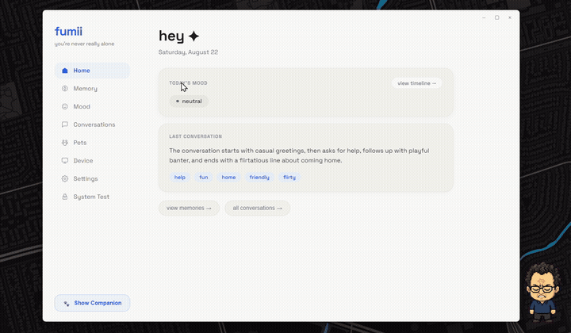

<div align="center">


# fumii 🤖

[GitHub](https://github.com/h55n/fumii) | [Releases](https://github.com/h55n/fumii/releases/tag/v2.0.0) | [Demo Video](https://youtu.be/OoZZ1LDStHE) | [Project Drive](https://drive.google.com/drive/folders/17kJrMC85nZk7DcOUeabH6yuBQqmyWgyE?usp=sharing)


[](https://github.com/h55n/fumii/releases/download/v2.0.0/fumii-2.0.0-windows-setup.exe)
[](https://github.com/h55n/fumii/releases/download/v2.0.0/fumii-2.0.0-windows-portable.zip)
[](https://github.com/h55n/fumii/releases/download/v2.0.0/fumii-2.0.0-linux-x64.tar.gz)
[](https://github.com/h55n/fumii/releases/download/v2.0.0/fumii-2.0.0-esp32s3-firmware.zip)
[](https://github.com/h55n/fumii/releases/download/v2.0.0/fumii-2.0.0-quadbot-firmware.zip)
[](LICENSE)


</div>

**fumii is a palm-sized physical AI companion that lives on your desk.** It has an animated TFT pixel face, listens through an I2S microphone, speaks through a neural voice engine, and remembers your life through a local-first memory graph that never leaves your machine. Unlike transactional smart speakers or screen-locked chatbots, fumii combines tangible hardware presence with deep episodic memory, a multi-provider LLM fallback cascade (Ollama, Groq, NVIDIA NIM, OpenAI, Anthropic, Gemini), local Whisper speech-to-text, and a transparent provenance system that shows you exactly which memories shaped every conversation before you decide to change them.

---

### 📹 Demo

<a href="https://youtu.be/OoZZ1LDStHE?si=KOBHb7X4dHyW35cv">
  
</a>

> ▶ *[Watch the full demo on YouTube](https://youtu.be/OoZZ1LDStHE?si=KOBHb7X4dHyW35cv) · GIF is 3× speed preview*


---

### 👥 The Team

| Name | Role | Focus |
|------|------|-------|
| **Mrunmayee Daware** | AI / LLM Integration | Prompt Engineering, Personality & Emotion Engine |
| **Hassan Rehman** | Software & System Architecture | Electron Core, Memory Provenance, React Dashboard |
| **Yash Gadhave** | Hardware & Embedded Engineering | PCB Design, Power, Component Sourcing & 3D Shell |
| **Tanishq Mhetras** | Firmware & Connectivity | ESP32-S3 Firmware, I2S Audio & MQTT/WS Protocols |

---


## 🏆 Hackathon Challenge: Provenance: Confirmation Step

> **Hackathon Requirement:** *Extend the MVP with a capability related to origin and lineage of important information. Specifically, add a confirmation step for important actions affected by this concept. Teams should be free to decide the implementation approach while demonstrating a complete user flow.*

### 🔍 Problem & Conceptual Motivation
In companion and agentic AI systems, memory is the backbone of personalization. However, most AI applications treat memory as an opaque black box: the user never knows **which memories** shaped a response, **how frequently** a memory was cited, or **what contextual consequences** will occur if a memory is altered or deleted. When users perform destructive actions (e.g., deleting a memory or erasing all history), traditional systems either trigger a generic, blind `confirm()` dialog or perform the deletion silently.

In **fumii**, we solved this by implementing an end-to-end **Provenance & Lineage Engine** coupled with **interactive confirmation steps** for all high-impact actions.

```
                             PROVENANCE & LINEAGE PIPELINE
                             
    User Input ───▶ Memory Search (TF-IDF & Core Profile)
                           │
                           ▼
             [ Assembled Prompt Context ] ───────────┐
                           │                         │
                           ▼                         ▼
             LLM Prompt Builder (LAC)       recordMemoryCitations()
                           │               (Asynchronous / Non-blocking)
                           ▼                         │
                   Streaming Tokens                  ▼
                                           memory_interactions Table
                                       - cite_count: Total prompt usages
                                       - first_cited: Discovery timestamp
                                       - last_cited: Most recent usage
                                                     │
                           ┌─────────────────────────┴─────────────────────────┐
                           ▼                                                   ▼
                 Single Memory Deletion                              Complete Knowledge Erasure
                           │                                                   │
                           ▼                                                   ▼
                 [ ProvenanceSheet.tsx ]                            [ ProvenanceAuditModal.tsx ]
         - Origin Date & Creation Age                       - Total memories & days of context
         - Influence Count: "shaped responses X×"           - Oldest to newest timeline span
         - Last-Used Context Timestamp                      - Knowledge domain & tag distribution
         - Context Consequence Explanation                  - Memory influence depth meter
         - Explicit: [keep it] vs [forget it]               - Explicit: [go back] vs [erase everything]
```

### 🛡️ Implementation Highlights

1. **Database Schema Extension (`electron/db/schema.ts`)**:
   - Added a dedicated, migration-safe `memory_interactions` table tracking `memory_id`, `cite_count`, `first_cited`, and `last_cited` timestamps.
2. **Zero-Latency Citation Tracking (`electron/db/queries.ts`, `electron/ipc/llmHandlers.ts`)**:
   - Whenever memories are extracted during `memory.profile()` and injected into prompt context, their citation counters are incremented in a fire-and-forget background operation, ensuring **zero added latency** to real-time LLM token streaming.
3. **`ProvenanceSheet` Component (`src/dashboard/components/ProvenanceSheet.tsx`)**:
   - Replaces raw browser confirm prompts with a sleek slide-up sheet when a user attempts to delete an individual memory.
   - Discloses creation date, citation frequency (`shaped responses X×`), last-used timestamp, topic tags, and explains what context fumii will lose.
4. **`ProvenanceAuditModal` Component (`src/dashboard/components/ProvenanceAuditModal.tsx`)**:
   - Replaces destructive "Clear All Memories" button clicks with a comprehensive lineage audit.
   - Presents aggregate metrics: total memories, total days of context covered, date of oldest memory vs most recent interaction, top knowledge tags, and a memory influence distribution bar.
5. **Visual Provenance Badges (`src/dashboard/pages/Memory.tsx`)**:
   - Memory cards in the dashboard dynamically surface a `cited X×` badge for memories that have actively shaped past conversations.
6. **Automated Diagnostic Suite (`electron/ipc/systemTestHandlers.ts`)**:
   - Added Test 9 (`Memory Provenance & Lineage`) to the automated self-test suite validating database citation increments, summary aggregation, and cascade deletion.

---

## 📦 Downloads & Releases (v2.0.0)

Pre-built binaries are available on the [**GitHub Releases Page**](https://github.com/h55n/fumii/releases/tag/v2.0.0):

| Platform | Type | Target Architecture | Download |
|----------|------|---------------------|----------|
| **Windows** | Setup Installer (`.exe`) | Windows 10/11 x64 (NSIS Assisted Setup) | [**Download `fumii-2.0.0-windows-setup.exe`**](https://github.com/h55n/fumii/releases/download/v2.0.0/fumii-2.0.0-windows-setup.exe) |
| **Windows** | Portable (`.zip`) | Windows 10/11 x64 (Zero-install standalone) | [**Download `fumii-2.0.0-windows-portable.zip`**](https://github.com/h55n/fumii/releases/download/v2.0.0/fumii-2.0.0-windows-portable.zip) |
| **Linux** | Tarball (`.tar.gz`) | Linux x64 (Standalone executable bundle) | [**Download `fumii-1.0.0-linux-x64.tar.gz`**](https://github.com/h55n/fumii/releases/download/v2.0.0/fumii-1.0.0-linux-x64.tar.gz) |
| **Linux** | Zip (`.zip`) | Linux x64 (Directory distribution) | [**Download `fumii-1.0.0-linux-x64.zip`**](https://github.com/h55n/fumii/releases/download/v2.0.0/fumii-1.0.0-linux-x64.zip) |
| **ESP32-S3** | Firmware Source (`.zip`) | PlatformIO ESP32-S3 Physical Companion | [**Download `fumii-2.0.0-esp32s3-firmware.zip`**](https://github.com/h55n/fumii/releases/download/v2.0.0/fumii-2.0.0-esp32s3-firmware.zip) |

---

## Table of Contents

1. [What fumii Is](#what-fumii-is)
2. [The Problem We Solve](#the-problem-we-solve)
3. [The Physical Companion Hardware](#the-physical-companion-hardware)
4. [The Desktop Companion App](#the-desktop-companion-app)
5. [Memory Engine & Least Available Context (LAC)](#memory-engine--least-available-context-lac)
6. [Multi-Provider LLM Fallback Cascade](#multi-provider-llm-fallback-cascade)
7. [Voice & Speech Engine (Local Whisper + Neural TTS)](#voice--speech-engine-local-whisper--neural-tts)
8. [Hardware Firmware & Protocol Bridges](#hardware-firmware--protocol-bridges)
9. [7-Page Management Dashboard](#7-page-management-dashboard)
10. [Design System & Aesthetics](#design-system--aesthetics)
11. [Security, Privacy & Keychain Isolation](#security-privacy--keychain-isolation)
12. [Project File Structure](#project-file-structure)
13. [Getting Started & Development Guide](#getting-started--development-guide)

---

## What fumii Is

<div align="center">

```
╔══════════════════════════════════════════════════════════════╗
║                                                              ║
║   fumii is a palm-sized physical AI companion               ║
║   that lives on your desk.                                   ║
║                                                              ║
║   She has an animated face. She listens. She remembers you.  ║
║   She is always there.                                       ║
║                                                              ║
║   Not a chatbot.  Not a smart speaker.  Not an app.         ║
║   A companion.                                               ║
║                                                              ║
╚══════════════════════════════════════════════════════════════╝
```

</div>

fumii is an **embodied AI companion ecosystem** consisting of:
1. **The Physical Companion (ESP32-S3)**: A palm-sized desktop robot with an animated 1.54" IPS TFT face screen, I2S microphone/speaker audio pipelines, EC11 rotary mode collar, WS2812B ambient LED ring, and DRV2605L haptic feedback.
2. **The Desktop Brain (Electron & React)**: A lightweight desktop software suite featuring an always-on-top transparent floating sprite, a rich 7-page management dashboard, in-process SQLite & TF-IDF memory indexing, and a multi-provider fallback LLM router.

```
  What fumii says:                    What fumii never says:

  "hey, you doing okay?"              "I understand your emotional state."
  "that sounds really hard"           "As an AI, I want to help."
  "you got through that exam thing,   "Great question! Here are 5 tips:"
   you'll get through this too"
  "is this about the supervisor thing?"
```

---

## The Problem We Solve

Millions of students, developers, and remote professionals work alone for hours each day. While smartphones exist, unlocking them leads directly to social media distraction. Voice assistants (Siri, Alexa) answer transactional queries but have **zero persistent memory of your life, zero warmth, and zero emotional presence**.

fumii fills this gap:
> **A persistent, warm, physically present desk companion that truly knows your journey.**

---

## The Physical Companion Hardware

```
                    ┌────────────────────────┐
                    │      fumii Device       │
                    │      (ESP32-S3 SoC)    │
                    │                          │
                    │  ┌────────────────────┐  │
                    │  │   1.54" IPS TFT    │  │  <- 240x240 Animated Face Screen
                    │  │   Face Display     │  │     (10 Emotion States)
                    │  │   [^_^]  *         │  │
                    │  └────────────────────┘  │
                    │                          │
                    │  INMP441 I2S Mic         │  <- Always-listening wake word + STT
                    │  MAX98357A I2S Speaker   │  <- Warm 48kHz neural voice playback
                    │  EC11 Rotary Collar      │  <- Physical mode selector switch
                    │  WS2812B RGB LED Ring    │  <- Ambient mood ring feedback
                    │  DRV2605L Haptic Driver  │  <- Tactile heartbeat/pulse motor
                    │  WiFi 802.11 b/g/n       │  <- LAN MQTT telemetry & WS Audio
                    └────────────┬─────────────┘
                                 │
                   Sits warmly on your workspace
```

### Hardware Components
| Component | Function | Driver / Protocol |
|-----------|----------|-------------------|
| **ESP32-S3-WROOM-1** | Dual-core 240MHz SoC, 8MB PSRAM, 16MB Flash | FreeRTOS / PlatformIO |
| **ST7789V 1.54" TFT** | 240×240 IPS display for pixel-art face rendering | Hardware SPI (DMA double-buffered) |
| **INMP441 MEMS Mic** | High-fidelity omnidirectional digital microphone | I2S Audio Capture (16kHz 16-bit PCM) |
| **MAX98357A DAC Amp** | 3.2W Class-D audio amplifier + 28mm speaker | I2S Audio Playback (DMA FIFO) |
| **EC11 Rotary Switch** | Physical collar switch: Companion vs Assistant mode | Hardware GPIO interrupts + Debounce |
| **WS2812B LED Ring** | 8-pixel RGB ambient mood and status glow | FastLED / RMT peripheral |
| **DRV2605L Haptics** | ERM/LRA tactile feedback driver | I2C (Haptic waveform patterns) |

---

## The Desktop Companion App

```
fumii Desktop Suite
├── Floating Sprite Window [Transparent overlay, 280×220px, always-on-top]
│   └── Chat Overlay [Expands smoothly to 280×700px on interaction]
│
└── Management Dashboard Window [1100×720px, hardware & memory control]
    ├── Home / Today        ← Daily reflection, mood indicator, quick message
    ├── Memory Graph        ← Full memory list, provenance badges, confirmation sheet & audit
    ├── Mood Timeline       ← 7-day emotional wave & frequency breakdown
    ├── Conversations       ← Session history & transcript viewer
    ├── Hardware Device     ← Real-time telemetry, pairing security, LED/haptic controls
    ├── Pets Marketplace   ← Pet sprite switcher with Codex CLI integration
    └── Settings            ← Multi-provider API keys, Whisper STT, Edge TTS voices, diagnostics
```

---

## Memory Engine & Least Available Context (LAC)

fumii never uploads your raw memory database to the cloud. Instead, it adheres strictly to the **Least Available Context (LAC)** principle: only the minimum relevant conversational tokens are assembled locally into the prompt.

```
Every conversation prompt is assembled from exactly four layers:

┌────────────────────────────────────────────────────────┐
│  Layer 1 — Autobiographical Facts (~500 tokens)        │
│  User traits extracted automatically from dialogues.   │
│  ("studies computer science", "lives in Pune").        │
└────────────────────────────────────────────────────────┘
                        +
┌────────────────────────────────────────────────────────┐
│  Layer 2 — Dynamic Episodic Memory (~300–400 tokens)   │
│  Keyword-indexed conversation snippets in SQLite.      │
│  Surfaced via fast in-process TF-IDF search.           │
└────────────────────────────────────────────────────────┘
                        +
┌────────────────────────────────────────────────────────┐
│  Layer 3 — 7-Day Emotional Weather Log (~150 tokens)   │
│  Rolling mood signals (stressed, happy, tired, etc.)   │
│  Calibrates fumii's empathy without re-explaining.     │
└────────────────────────────────────────────────────────┘
                        +
┌────────────────────────────────────────────────────────┐
│  Layer 4 — Provenance Interactions                     │
│  Tracks citation counts, discovery & last-used dates.  │
│  Powers transparent deletion & clear-all audit flows.  │
└────────────────────────────────────────────────────────┘
```

---

## Multi-Provider LLM Fallback Cascade

fumii includes an automatic fallback router in `electron/services/LLMService.ts`. If your primary local model or cloud provider experiences rate limits or network issues, fumii seamlessly tries the next configured provider without interrupting the user:

```
Ollama (Local Qwen 2.5) ──▶ Groq (Llama 3.3) ──▶ NVIDIA NIM ──▶ Mistral AI ──▶ OpenAI ──▶ Anthropic ──▶ Google Gemini ──▶ Cached In-Character Fallback
```

### Character Prompt Rules
- Always lowercase typography. Sentences under 30 words.
- Natural references to past memories without announcing retrieval.
- Zero clinical corporate phrases ("As an AI language model...", "I understand your frustration").

---

## Voice & Speech Engine (Local Whisper + Neural TTS)

1. **Speech-to-Text (STT)**:
   - **Local Whisper.cpp Engine (`electron/services/WhisperService.ts`)**: In-process STT model downloader and manager supporting `tiny.en` (75MB), `base.en` (142MB), `small.en` (466MB), and multilingual models.
   - **Zero Audio Leakage**: Speech is transcribed entirely locally on your CPU/GPU.
2. **Text-to-Speech (TTS)**:
   - **Microsoft Neural Edge TTS (`electron/services/EdgeTTSService.ts`)**: Ultra-natural, soothing voices with 7 pre-calibrated presets (`en-US-JennyNeural`, `en-US-AriaNeural`, `en-US-AnaNeural`, `en-GB-SoniaNeural`, `en-US-MichelleNeural`, `en-US-GuyNeural`, `en-US-RyanNeural`).
   - Generates high-quality 48kHz audio streams with zero subscription fees or external API keys.

---

## Hardware Firmware & Protocol Bridges

The `firmware/` directory contains the complete PlatformIO C++ codebase for the ESP32-S3:
- **`DisplayManager`**: Double-buffered TFT driver rendering 10 expressive facial animation states (`idle`, `listening`, `thinking`, `speaking`, `happy`, `concerned`, `excited`, `sleepy`, `waving`, `provisioning`).
- **`AudioCapture` & `AudioPlayback`**: Real-time 16kHz PCM audio streaming over WebSockets (`:8765`).
- **`MQTTHandler`**: Telemetry and control protocol connecting to the embedded desktop Aedes MQTT broker (`:1883`) with Last Will & Testament (LWT) for instant offline detection.
- **`WiFiProvisioning`**: SoftAP web captive portal (`fumii-setup-XXXX`) allowing instant WiFi setup from any smartphone or browser.

---

## 7-Page Management Dashboard

```
┌─────────────────────────────────────────────────────────────────────────────┐
│  fumii dashboard  [ Home | Memory | Mood | Convs | Device | Pets | Config ] │
├─────────────────────────────────────────────────────────────────────────────┤
│                                                                             │
│  [ Home ]          Today's emotional weather, quick chat, daily summary.   │
│  [ Memory ]        Keyword search, topic tags, cited X× badges,             │
│                    ProvenanceSheet delete, ProvenanceAuditModal clear-all.  │
│  [ Mood Timeline ] 7-day emotional wave visualization & mood distribution.  │
│  [ Conversations ] Session history and searchable message transcripts.      │
│  [ Device ]        Live hardware telemetry (Battery %, WiFi RSSI), pairing  │
│                    handshake, LED mood ring color picker, haptic tests.     │
│  [ Pets ]          Codex Pet sprite switcher and community pet registry.    │
│  [ Settings ]      Keychain API keys, Whisper STT models, Neural TTS voices,│
│                    and 9-point automated system diagnostic suite.           │
│                                                                             │
└─────────────────────────────────────────────────────────────────────────────┘
```

---

## Design System & Aesthetics

fumii follows the **Pixel Warmth Meets Soft Modernism** design language:
- **Color Palette (`src/styles/tokens.css`)**: Warm ivory canvas (`#FAFAF7`), soft cream cards (`#FFFFFF`, `#F1F1EB`), deep charcoal typography (`#1E2022`), electric cobalt accents (`#2563EB`), and emerald signals (`#10B981`).
- **Typography**: Space Grotesk for body and headers; Departure Mono / DM Mono for provenance metadata, tags, and timestamps.
- **Micro-Interactions**: Ambient amber glows, subtle hover physics, and smooth slide-up confirmation sheets.

---

## Security, Privacy & Keychain Isolation

| Concern | Technical Implementation |
|---------|--------------------------|
| **API Keys** | Stored exclusively in the OS Keychain via `keytar`. Never written to disk or sent to the renderer. |
| **Local Memory** | SQLite database stored in user application data. Memories are never shared or synced externally. |
| **Process Security** | `nodeIntegration: false`, `contextIsolation: true`, `sandbox: true` on all Electron windows. |
| **LAN Hardware Pairing** | CSPRNG 256-bit token authentication over local MQTT. Unpaired devices are rejected. |

---

## Project File Structure

```
fumii/
├── assets/                    # Application icons, fonts, sound effects, pet bundles
├── cli/                       # Codex Pet CLI (npx fumii commands for community sprites)
├── docs/                      # Architectural reference documentation & specifications
│   └── ARCHITECTURE.md        # Master technical reference & hardware specs
├── electron/                  # Electron main process backend
│   ├── db/                    # SQLite database schema & queries (with Provenance)
│   ├── ipc/                   # Secure IPC handlers (Memory, LLM, TTS, Pet, System Test)
│   ├── services/              # LLM router, Memory engine, Whisper STT, Edge TTS, MQTT broker
│   ├── windows/               # Dashboard and Sprite window managers
│   ├── main.ts                # Main process entry point
│   └── preload.ts             # ContextBridge secure API bridge
├── firmware/                  # ESP32-S3 PlatformIO C++ firmware
│   ├── include/               # Drivers: Display, Audio, MQTT, LED, Haptics, WiFi
│   ├── src/                   # Driver implementations & main loop
│   └── platformio.ini         # PlatformIO build & board configuration
├── public/                    # Static favicon and branding assets
├── scripts/                   # Icon generators, SVG converters, Windows launcher scripts
├── src/                       # React frontend renderer
│   ├── chat/                  # Chat overlay, message bubbles, input field
│   ├── dashboard/             # Dashboard shell, navigation, TitleBar
│   │   ├── components/        # ProvenanceSheet, ProvenanceAuditModal
│   │   └── pages/             # Home, Memory, Mood, Conversations, Device, Pets, Settings
│   ├── pet/                   # Canvas 2D Pet sprite rendering widget
│   ├── sprite/                # Transparent desktop sprite window & emotion engine
│   ├── store/                 # Zustand stores (app, chat, device, pet, settings)
│   └── styles/                # CSS tokens and component styles
├── dashboard.html             # Vite entry point for dashboard window
├── sprite.html                # Vite entry point for sprite window
├── electron-builder.json      # Cross-platform installer & packaging configuration
├── electron.vite.config.ts    # Dual-target Vite bundler configuration
├── package.json               # Node.js dependencies & scripts (v2.0.0)
├── CHANGELOG.md               # Version history and feature log
├── LAUNCH.bat                 # 1-click Windows launcher
└── README.md                  # Master documentation & project guide
```

---

## Getting Started & Development Guide

### Prerequisites
- **Node.js 20+**
- **npm**

### 1. Clone and Install
```bash
git clone https://github.com/h55n/fumii.git
cd fumii
npm install
```

### 2. Run in Development Mode
```bash
# Start desktop companion (Sprite + Dashboard)
npm run dev

# Start with hardware bridges (MQTT Broker + WebSocket Audio Server)
npm run dev:hardware
```

### 3. Build Production Installers
```bash
# Windows Setup Installer & Portable Zip
npm run build:win

# Linux AppImage & Debian Package
npm run build:linux

# macOS DMG & Zip Bundle
npm run build:mac
```

---

## 📡 Hardware & Zero-Friction Wi-Fi Pairing

Fumii supports direct Wi-Fi pairing across **Windows**, **Linux**, and **macOS** with zero manual IP setup:

1. **Fumii Companion Device (ESP32-S3):**
   - Connects to Wi-Fi via captive portal on SoftAP `fumii-setup-XXXX` (`http://192.168.4.1`).
   - Automatically discovers your desktop computer on the LAN using UDP beacon on port `8766` and connects to the local MQTT broker (port `1883`) and Audio WebSocket (port `8765`).
   - One-click cryptographic pairing from the **Device & Companion** page.
2. **ACEBOTT QD020 QuadBot (ESP8266):**
   - 8-servo quadruped robot powered by snappy v3 motion curve firmware in [`firmware-quadbot/`](firmware-quadbot/).
   - Broadcasts standalone Wi-Fi AP `QuadBot-E` (password `12345678`) with a touch-friendly web control panel at `http://192.168.4.1`.
3. **Full Pairing & Releases Guide:**
   - See [`docs/HARDWARE_PAIRING_AND_RELEASES.md`](docs/HARDWARE_PAIRING_AND_RELEASES.md) for Linux UFW firewall rules, firmware flashing steps, and troubleshooting.

---

<div align="center">

*fumii is built with the belief that the best technology disappears into the background —*  
*not because it's invisible, but because it feels like it belongs.*

<br/>

**fumii** · *you're never really alone*

</div>
